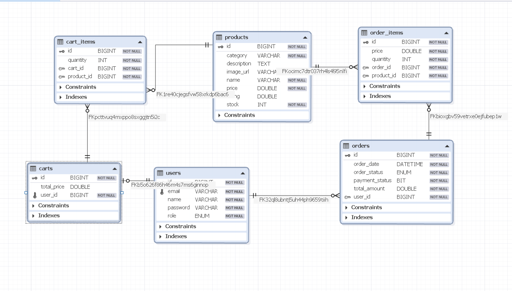
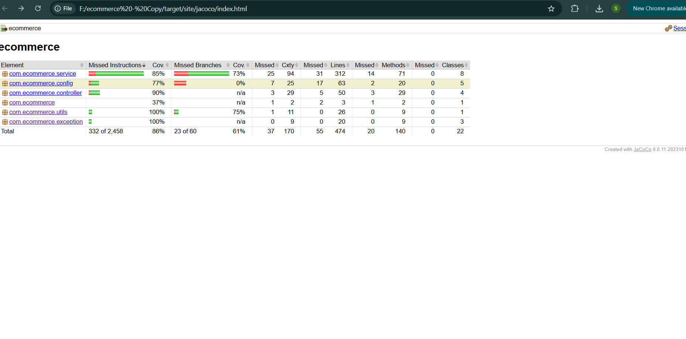

# 🛒 E-Commerce Backend System

A scalable and production-ready **backend system for an e-commerce platform** built using **Java 21, Spring Boot 3, and MySQL**.

The system follows modern backend engineering practices including:

* **Layered Architecture**
* **RESTful API Design**
* **JWT-based Authentication**
* **Secure Role-Based Authorization**
* **Dockerized Deployment**
* **Automated Test Coverage using JaCoCo**

The goal of this project is to demonstrate how a **real-world e-commerce backend** can be structured using industry-standard technologies and clean architecture principles.

---

# 🌐 API Base URL

```
http://localhost:8081/api
```

---

# 🚀 Core Features

## 👤 User Management

Handles authentication and user administration.

Capabilities include:

* User registration
* Secure login using **JWT authentication**
* Role-based access control (**ADMIN / CUSTOMER**)
* Profile management
* Admin control over platform users

**Security Implementation**

* Password encryption using **BCrypt**
* Stateless authentication using **JWT tokens**
* Secure endpoint protection via **Spring Security filters**

---

## 📦 Product Management

Allows administrators to manage products and customers to browse available items.

Features include:

* Add new products
* Update product details
* Delete products
* View product catalog
* Pagination for large product lists
* Filtering support

This module ensures **efficient product management for scalable e-commerce systems.**

---

## 🛒 Cart Management

The cart module enables customers to manage selected products before checkout.

Supported operations:

* Add items to cart
* Update cart item quantity
* Remove items from cart
* Calculate cart totals dynamically

Cart data is linked to **authenticated users** ensuring personalized shopping sessions.

---

## 📑 Order Management

Handles the checkout process and order tracking.

Features include:

* Place new orders
* Track order history
* View order details
* Manage order statuses

Orders are generated from cart items and stored with proper relational mapping.

---

## 📉 Inventory Management

Maintains accurate stock levels for all products.

When an order is successfully placed:

* Product stock is automatically deducted
* Inventory updates prevent overselling

This ensures **data consistency and reliable inventory tracking**.

---

## 💳 Payment Processing

A **simulated payment gateway** is implemented to demonstrate payment flow integration.

Workflow:

1. User initiates checkout
2. Payment is processed (simulated)
3. Order status is updated
4. Inventory is reduced

This structure allows future integration with real payment providers such as **Stripe or Razorpay**.

---

# 🏗️ Technology Stack

| Layer             | Technology                  |
| ----------------- | --------------------------- |
| Language          | Java 21                     |
| Framework         | Spring Boot 3               |
| Build Tool        | Maven                       |
| Database          | MySQL                       |
| ORM               | Spring Data JPA / Hibernate |
| Security          | Spring Security + JWT       |
| API Documentation | Swagger (OpenAPI 3)         |
| Object Mapping    | ModelMapper                 |
| Testing           | JUnit                       |
| Code Coverage     | JaCoCo                      |
| Containerization  | Docker + Docker Compose     |

---

# 📂 Project Architecture

The project follows a **layered architecture pattern** for maintainability and scalability.

```
controller  → Handles incoming HTTP requests
service     → Contains core business logic
repository  → Handles database interaction
entity      → Database entities mapped using JPA
dto         → Request and response data objects
config      → Security configuration and application settings
```

### Architectural Benefits

* Clear separation of concerns
* Easier debugging and testing
* Scalable for larger systems
* Maintainable codebase

---

# 📁 Project Structure

```
src/main/java
│
├── controller
│   └── REST API endpoints
│
├── service
│   └── Business logic
│
├── repository
│   └── Database interaction layer
│
├── entity
│   └── JPA entity models
│
├── dto
│   └── Request / response objects
│
├── security
│   └── JWT authentication filters
│
└── config
    └── Spring configuration classes
```

---

# 🗄️ Database Design (ER Diagram)

The database is designed using a **relational schema** connecting core e-commerce entities.

Key entities include:

* Users
* Products
* Cart
* Orders
* Order Items

<p align="center">
  
</p>

---

# 🧪 Test Coverage (JaCoCo)

Unit tests are implemented to ensure reliability of the service layer and critical components.

The project integrates **JaCoCo** to generate code coverage reports.

<p align="center">
  
</p>

Benefits of using JaCoCo:

* Identify untested code
* Improve software reliability
* Maintain high code quality

---

# 📚 API Documentation

The project integrates **Swagger (OpenAPI 3)** for API documentation and testing.

After starting the application, open:

```
http://localhost:8081/swagger-ui/index.html
```

Swagger allows developers to:

* Explore available REST endpoints
* Send API requests directly from the browser
* Authenticate using JWT tokens
* Test request payloads and responses

---

# 🔐 Authentication Flow

Authentication is handled using **JWT (JSON Web Tokens)**.

### Login Flow

1. User sends login request

```
POST /api/users/login
```

2. Server validates credentials

3. JWT token is generated and returned

4. Token must be included in subsequent requests

```
Authorization: Bearer <token>
```

5. Spring Security filter validates the token

---

# 🛠️ Running the Application Locally

## 1️⃣ Prerequisites

Ensure the following are installed:

* Java 21+
* Maven 3.8+
* MySQL Server
* Docker Desktop (optional)

---

## 2️⃣ Database Setup

Create the database:

```sql
CREATE DATABASE IF NOT EXISTS ecommerce_db;
```

Then execute the provided:

```
schema.sql
```

---

## 3️⃣ Configure Database Credentials

Update credentials in:

```
src/main/resources/application.properties
```

Example configuration:

```
spring.datasource.url=jdbc:mysql://localhost:3306/ecommerce_db
spring.datasource.username=YOUR_USERNAME
spring.datasource.password=YOUR_PASSWORD
```

---

## 4️⃣ Build the Project

```
./mvnw clean install
```

---

## 5️⃣ Run the Application

```
./mvnw spring-boot:run
```

The backend server will start at:

```
http://localhost:8081
```

Swagger documentation will be available at:

```
http://localhost:8081/swagger-ui/index.html
```

---

# 🐳 Running with Docker

Docker ensures consistent environments across machines.

## Configure Environment Variables

Create `.env` file:

```
SPRING_DATASOURCE_URL=jdbc:mysql://host.docker.internal:3306/ecommerce_db
SPRING_DATASOURCE_USERNAME=YOUR_USERNAME
SPRING_DATASOURCE_PASSWORD=YOUR_PASSWORD
```

---

## Start Containers

```
docker compose up --build
```

The API will be available at:

```
http://localhost:8081
```

Swagger UI:

```
http://localhost:8081/swagger-ui/index.html
```

---

## Stop Containers

```
docker compose down
```

To reset containers and volumes:

```
docker compose down -v
```

---

# 📦 Repository Contents

This repository includes:

* Complete **Spring Boot Backend Source Code**
* API Documentation
* Database schema
* Docker configuration
* Postman API collection
* JaCoCo coverage report
* ER Diagram

---

# 🎯 Key Learning Outcomes

This project demonstrates:

* Designing scalable **REST APIs**
* Implementing **JWT-based authentication**
* Building a **layered Spring Boot architecture**
* Managing relational databases with **Spring Data JPA**
* Containerizing backend services with **Docker**
* Monitoring code quality with **JaCoCo coverage reports**

---

# 🚀 Future Improvements

Potential enhancements for this project:

* Integration with real payment gateways
* Redis caching for performance optimization
* API rate limiting
* Microservices architecture
* CI/CD pipeline integration
